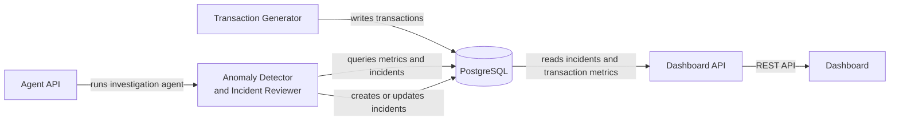

# Control Tower architecture

## Components

- **Transaction Generator** produces synthetic payment transactions and writes them to PostgreSQL.
- **PostgreSQL** is the shared system of record for transactions, baseline metrics, and incidents.
- **Dashboard API** reads operational data from PostgreSQL and exposes it to the dashboard.
- **Dashboard** displays payment activity and incidents through the Dashboard API.
- **Agent API** starts the investigation workflow.
- **Investigation agent** queries PostgreSQL for payment metrics and incident context, then creates or updates incidents in PostgreSQL.
