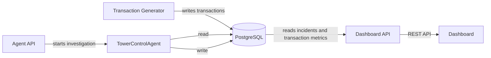

# Control Tower architecture

## Components

- [**Transaction Generator**](scripts/ingestion/generator/README.md) produces synthetic payment
  transactions and writes them to PostgreSQL.
- [**PostgreSQL**](data/README.md) is the shared system of record for transactions, baseline
  metrics, and incidents.
- [**Dashboard API**](services/dashboard_api/README.md) reads operational data from PostgreSQL
  and exposes it to the dashboard.
- [**Dashboard**](apps/dashboard/README.md) displays payment activity and incidents through the
  Dashboard API.
- [**Agent API**](services/agent_api/README.md) starts the investigation workflow.
- **TowerControlAgent** is the multi-agent orchestration that reads investigation context from
  PostgreSQL and writes the resulting operational records. See the [detailed agent and tool
  orchestration](services/agent_api/README.md#orchestration).
