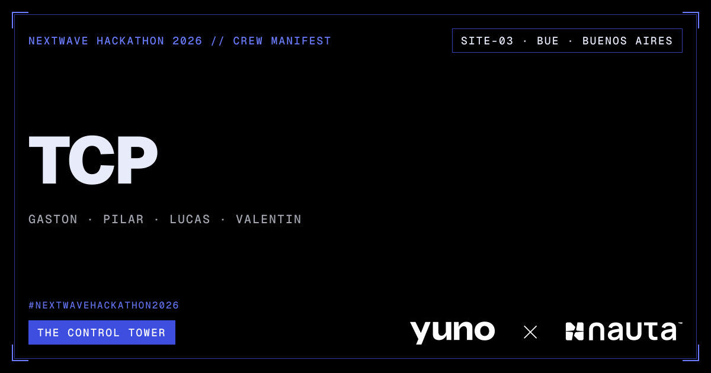

## Architecture

The [high-level architecture](ARCHITECTURE.md) shows the Control Tower components and their
database boundary. `TowerControlAgent` is the multi-agent orchestration that reads investigation
context and writes operational records; its detailed agent-and-tool flow is documented in the
[Agent API README](services/agent_api/README.md#orchestration).

Component documentation:

- [Transaction Generator](scripts/ingestion/generator/README.md)
- [PostgreSQL data layer](data/README.md)
- [Dashboard API](services/dashboard_api/README.md)
- [Dashboard](apps/dashboard/README.md)
- [Agent API](services/agent_api/README.md)

## Local development

Database credentials live in `data/.env`; start from `data/.env.example`.
Place large, local-only CSV files in `data/local/`, for example
`data/local/baseline.csv`.

For local development, `data/.env` is the source of truth for database
credentials. The `make db-init` and `make agent-api` commands deliberately
discard inherited `DATABASE_URL` and `POSTGRES_*` shell variables, preventing
stale terminal or direnv credentials from overriding that file.

```bash
make db-up
make db-init HISTORY=data/local/baseline.csv
```

Run each application in a separate terminal:

```bash
make dashboard-api  # http://127.0.0.1:8000
make agent-api      # http://127.0.0.1:8001
make dashboard      # Vite development server
```

## Repository layout

**Core system:** `services/agent_api/app/` contains the TowerControlAgent multi-agent
orchestration and its specialist agents.

```text
.
├── apps/
│   └── dashboard/              # React/Vite dashboard
├── services/
│   ├── dashboard_api/          # Dashboard FastAPI API (port 8000)
│   └── agent_api/              # Agent orchestration FastAPI API (port 8001)
│       └── app/                # TowerControlAgent and specialist agent application
├── data/
│   ├── db_migrations/          # Ordered, versioned database changes
│   ├── schemas/                # Transaction and baseline schema definitions
│   ├── seeds/                  # Deterministic SQL seed data
│   ├── fixtures/               # Small committed example datasets
│   ├── local/                  # Ignored local CSV datasets
│   └── docker-compose.yml
├── scripts/
│   ├── db/init_db.py           # Schema, history, and baseline initialization
│   └── ingestion/              # History load, live replay, and status scripts
├── docs/                       # Challenge documentation and decision log
├── Makefile                    # Local development commands
└── requirements-dev.txt        # Shared development tooling
```

## Incident workflow

`TowerControlAgent` coordinates the incident workflow:

1. `AnomalyDetector` analyzes the latest completed five-minute payment window and returns a
   strict JSON Schema result.
2. `IncidentReviewer` compares that result with all open incidents and
   uses semantic searches over closed-incident memory and payment deployment logs.
3. A deterministic SQLAlchemy persistence stage—not an agent—creates new incidents and applies
   complete updates to existing ones in a transaction.
4. `ActionTaker` runs only for newly created incidents. It records one draft-only operational
   action per incident: deployment rollback guidance takes priority, then a merchant-approved
   provider-switch recommendation with provider-escalation draft, then a shared Slack alert draft.

The [Agent API README](services/agent_api/README.md#orchestration) shows each agent's tools and
database context. The dashboard mock seed includes incidents and ActionTaker drafts only; it does
not include transactions or baseline metrics.

Incident, incident-memory, deployment-log, and incident-action persistence use SQLAlchemy models. Analytical
transaction/baseline queries remain parameterized read-only metric queries. The investigation API
response includes the detector result, reviewer proposals, and the IDs committed by persistence.

All incident schema changes belong in `data/db_migrations/`; `scripts/db/init_db.py` records
applied migration filenames in `schema_migrations`.

## Developer checks

Install the API and shared development dependencies, then activate the hooks once per clone:

```bash
pip install -r requirements-dev.txt
pre-commit install --hook-type pre-commit --hook-type commit-msg
```

Commits must follow Conventional Commits, for example `feat: add incident memory`
or `fix(agent): handle an empty baseline`. Run all Python lint and format checks
at any time with:

```bash
make lint
```
