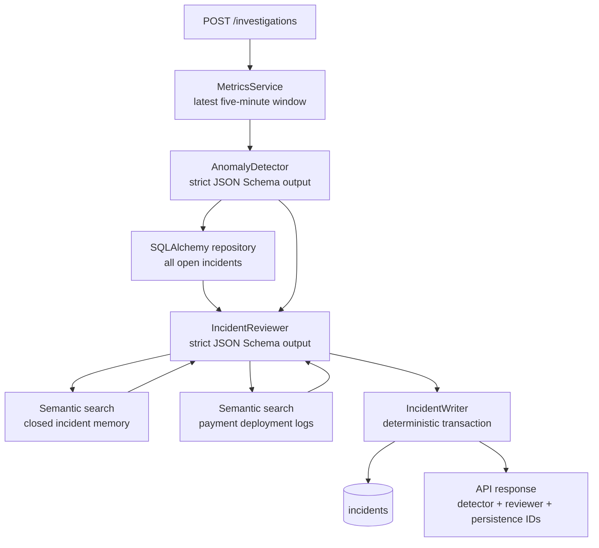

# Agent API

FastAPI service implementing the Control Tower investigation orchestration. Its first specialist,
`AnomalyDetector`, compares a current five-minute window with weekday baseline metrics. Its
validated output is passed to `IncidentReviewer`, which returns proposals for new or updated
incidents. Both stages use strict JSON Schema Structured Outputs and can only call typed tools;
they cannot issue SQL directly.

## Orchestration



## Run locally

Configure shared PostgreSQL settings in `data/.env`, then initialize the database from the
repository root:

```sh
make db-up
make db-init HISTORY=data/local/baseline.csv
python -m venv .venv
. .venv/bin/activate
pip install -r services/agent_api/requirements.txt
cp services/agent_api/.env.example services/agent_api/.env
make agent-api
```

Set `OPENAI_API_KEY` in `services/agent_api/.env`. The agent API runs on port `8001`,
keeping port `8000` available for the dashboard API.

The SQLAlchemy incident repository validates pooled database connections before checkout, so
connections made stale by a local PostgreSQL restart are transparently recreated.

Run payment anomaly detection. It analyzes the latest *completed* five-minute bucket;
pass `as_of` to make a demo or test use a specific point in time.

The response contains the structured detector result, a `reviewer` result with
`new_incidents` and `updated_incidents`, and a `persistence` record. A deterministic
SQLAlchemy writer applies the reviewer proposals after the agent workflow; neither agent writes
to the database directly.

```sh
curl -X POST http://localhost:8001/investigations \
  -H 'content-type: application/json' \
  -d '{
    "as_of":"2026-08-29T14:05:00"
  }'
```

## Arize AX tracing

The agent, its database tools, and OpenAI calls are traced when all Arize AX
settings are present. Configure your own Arize region endpoint—this project does
use the US collector by default:

```env
ARIZE_SPACE_ID=...
ARIZE_API_KEY=...
ARIZE_PROJECT_NAME=control-tower
ARIZE_COLLECTOR_ENDPOINT=https://otlp.arize.com/v1
```

Restart Uvicorn after setting these values, then run an investigation to export
the trace. `tower_control_agent` creates a CHAIN span that contains AGENT spans for each
specialist, each metric tool creates a TOOL span, and OpenAI calls are automatically
instrumented. IncidentReviewer semantic searches for closed incidents and payment deploys are
also emitted as TOOL spans.
