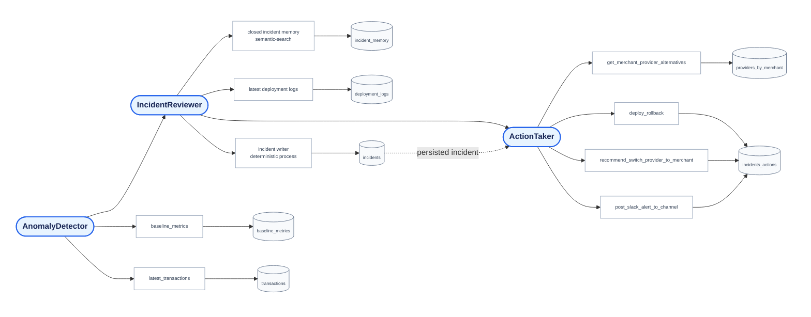

# Agent API

FastAPI service implementing the Control Tower investigation orchestration. Its first specialist,
`AnomalyDetector`, compares a current one-minute window with weekday baseline metrics. Its
validated output is passed to `IncidentReviewer`, which returns proposals for new or updated
incidents. Both stages use strict JSON Schema Structured Outputs and can only call typed tools;
they cannot issue SQL directly.

## Orchestration



## Run locally

Configure shared PostgreSQL settings in `data/.env`, then initialize the database from the
repository root:

```sh
make db-up
make db-init HISTORY=data/local/baseline.csv
python -m venv .venv
. .venv/bin/activate
pip install -r services/agent_api/requirements.txt
cp services/agent_api/.env.example services/agent_api/.env
make agent-api
```

Set `OPENAI_API_KEY` in `services/agent_api/.env`. The agent API runs on port `8001`,
keeping port `8000` available for the dashboard API.

The SQLAlchemy incident repository validates pooled database connections before checkout, so
connections made stale by a local PostgreSQL restart are transparently recreated.

Run payment anomaly detection. It analyzes the latest *completed* one-minute bucket;
pass `as_of` to make a demo or test use a specific point in time. The API resolves this to a
canonical `[started_at, last_seen_at)` window and supplies it to both agents. New incidents use
the window start as `started_at`; all proposals use its end as `last_seen_at`; updates preserve
the existing incident's `started_at`. Naive `as_of` values are interpreted as UTC.

The response contains the structured detector result, a `reviewer` result with
`new_incidents` and `updated_incidents`, the per-new-incident `action_taker` results, and both
persistence records. A deterministic SQLAlchemy writer applies reviewer and action proposals;
agents never write to the database directly. ActionTaker selects exactly one draft-only action
per new incident: linked deployment rollback guidance, otherwise an approved provider-switch
recommendation with provider escalation draft, otherwise a merchant shared-Slack alert draft.

```sh
curl -X POST http://localhost:8001/investigations \
  -H 'content-type: application/json' \
  -d '{
    "as_of":"2026-08-29T14:05:00"
  }'
```

## Demo scheduler

`scripts/agent/run_scheduled_investigation.py` runs one investigation using the
Generator UI's current simulated timestamp as `as_of`. It skips safely while
live ingestion is stopped and uses a local lock file to prevent overlapping
investigations.

Run it once from the repository root with:

```sh
make agent-scheduled-investigation
```

For the demo, a local cron entry runs it once per real minute. It requires the
agent API and Generator UI to be running first. Replace `/absolute/path/to/repo`
with the clone path:

```cron
* * * * * cd /absolute/path/to/repo && .venv/bin/python scripts/agent/run_scheduled_investigation.py >> /tmp/control-tower-agent-scheduler.log 2>&1
```

The scheduler uses the Generator's current timestamp, so each run analyzes the
latest completed one-minute window. Inspect its output with
`tail -f /tmp/control-tower-agent-scheduler.log`. It skips a tick when the stream
is stopped or an earlier investigation still holds the lock.

## Arize AX tracing

The agent, its database tools, and OpenAI calls are traced when all Arize AX
settings are present. Configure your own Arize region endpoint—this project does
use the US collector by default:

```env
ARIZE_SPACE_ID=...
ARIZE_API_KEY=...
ARIZE_PROJECT_NAME=control-tower
ARIZE_COLLECTOR_ENDPOINT=https://otlp.arize.com/v1
```

Restart Uvicorn after setting these values, then run an investigation to export
the trace. `tower_control_agent` creates a CHAIN span that contains AGENT spans for each
specialist, each metric tool creates a TOOL span, and OpenAI calls are automatically
instrumented. IncidentReviewer semantic searches for closed incidents and payment deploys are
also emitted as TOOL spans.
